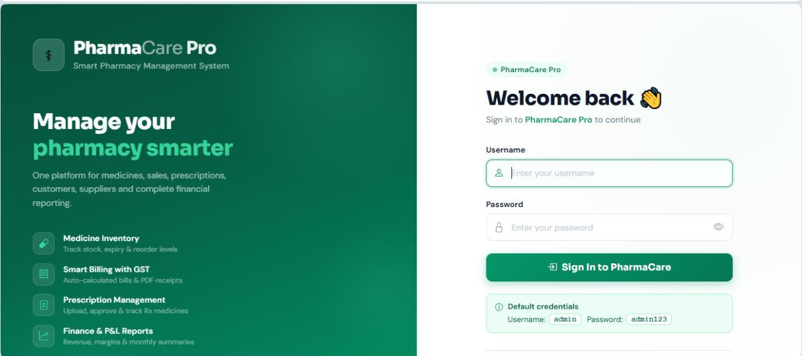
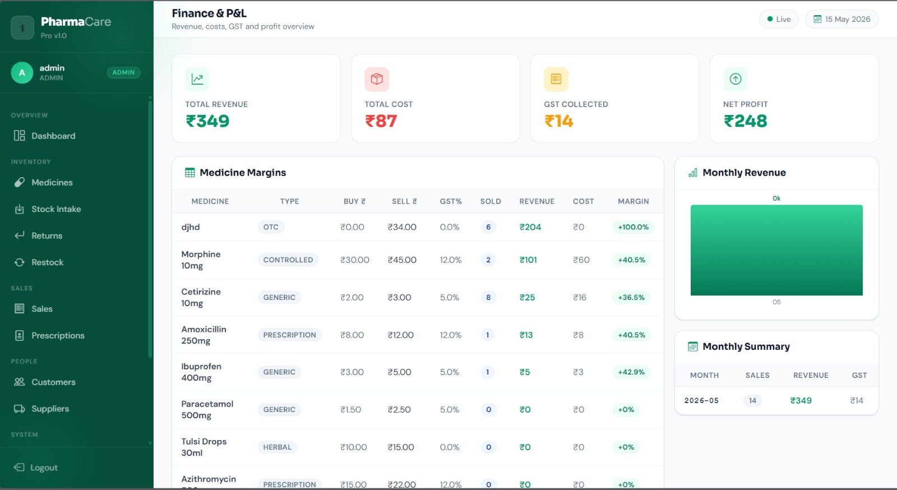
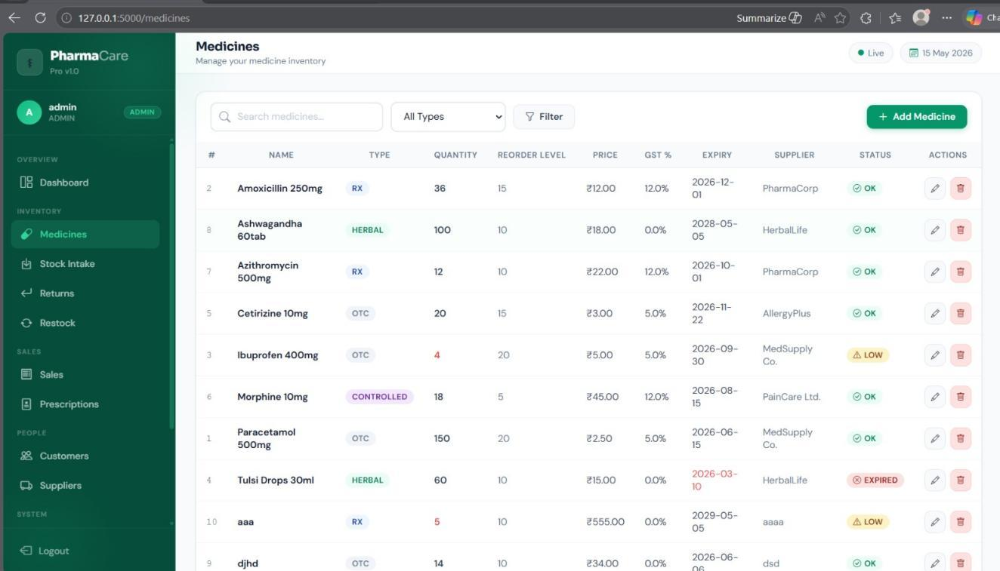
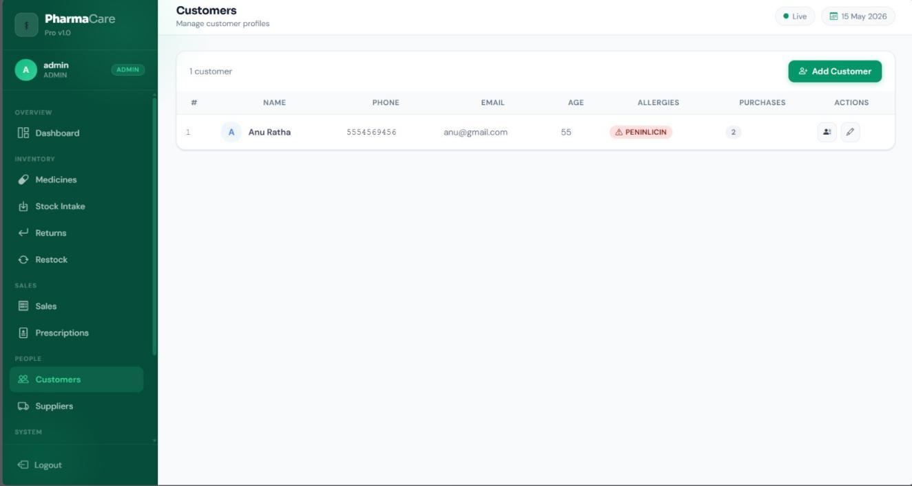
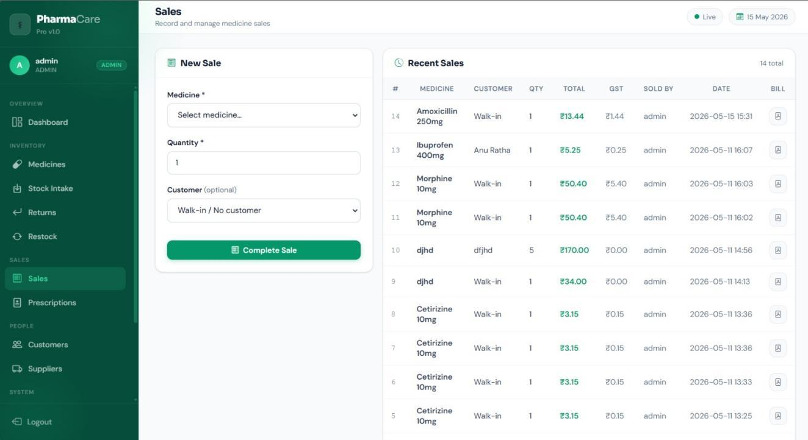
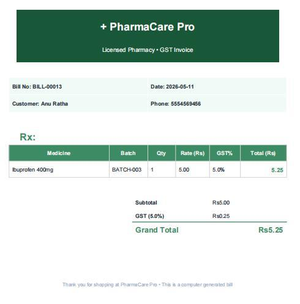

# Pharmacy Management System — PharmaCare

A web-based **Pharmacy Management System** developed as a Mini Project (**24CSE48**) for the academic year **2025–26 (Even Semester)** at the **Department of Computer Science and Engineering, New Horizon College of Engineering, Bengaluru**.

PharmaCare is designed to digitize core pharmacy operations by providing a centralized system for **medicine management, inventory monitoring, sales and billing, user administration, expiry monitoring, and audit logging**. The application is implemented using Python and Flask with SQLite as the database.

---

## Project Information

| Category      | Details                                       |
| ------------- | --------------------------------------------- |
| Project Title | Pharmacy Management System — PharmaCare       |
| Project Type  | Mini Project                                  |
| Course Code   | 24CSE48                                       |
| Academic Year | 2025–26                                       |
| Semester      | Even Semester                                 |
| Department    | Computer Science and Engineering              |
| Institution   | New Horizon College of Engineering, Bengaluru |

---

## Authors

| Name                             | USN        | Semester – Section |
| -------------------------------- | ---------- | ------------------ |
| **H Suruthi**                    | 1NH24CS220 | 4 – D              |
| **Tammineedi Lakshmi Chinmayee** | 1NH24CS221 | 4 – D              |

**Project Guide / Reviewer:**
Ms. Pravallika Medidi
Assistant Professor, Department of Computer Science and Engineering
New Horizon College of Engineering

---

## Overview

Traditional pharmacy operations often involve maintaining medicine records, stock information, sales details, and staff activities manually. Such processes can make it difficult to maintain consistent records, monitor inventory levels, identify expired medicines, and track operational activities.

**PharmaCare** provides a web-based interface for managing these operations through a centralized application.

The system supports:

* User authentication and role-based access
* Medicine and inventory management
* Sales and billing
* Expiry and low-stock monitoring
* Staff account management
* Audit logging
* Medicine categorization using object-oriented design
* Automated background monitoring

The project demonstrates the application of **Python programming, Flask web development, SQLite database management, object-oriented programming, authentication, session management, and basic security practices** in a practical software system.

---

## Key Features

### 1. Authentication and Role-Based Access

* User login with session-based authentication
* SHA-256 password hashing
* Role-based access for:

  * `admin`
  * `pharmacist`
* Restricted administrative operations based on user role

### 2. Dashboard

The dashboard provides an overview of the current pharmacy inventory, including:

* Total medicines
* Low-stock medicines
* Expired medicines
* Medicines approaching expiry
* Active alerts

### 3. Medicine and Inventory Management

The system provides functionality to:

* Add medicines
* Edit medicine information
* Delete medicines
* Search medicines
* Filter medicines by name and type
* Monitor available quantities
* Validate medicine quantity and price values
* Restrict deletion operations to authorized users

### 4. Sales and Billing

The sales module supports:

* Recording medicine sales
* Validating requested quantities against available stock
* Automatically reducing inventory after a sale
* Calculating total prices
* Generating billing information

### 5. Automated Expiry and Stock Monitoring

A background daemon thread periodically checks the database for relevant inventory conditions.

The monitoring mechanism identifies:

* Expired medicines
* Medicines approaching expiry
* Low-stock medicines

The application also exposes alert information through the:

```text
/api/alerts
```

JSON endpoint.

### 6. User Management

Administrators can manage staff accounts by:

* Creating user accounts
* Assigning user roles
* Removing staff accounts

### 7. Audit Logging

Important system activities are recorded in an audit log, including operations such as:

* Medicine creation
* Medicine modification
* Medicine deletion
* Sales
* User-related actions

The log records the associated user and timestamp to support traceability.

### 8. Object-Oriented Medicine Model

The application uses an object-oriented design based on an abstract `Medicine` class.

The implementation includes specialized medicine types such as:

* `GenericMedicine`
* `PrescriptionMedicine`
* `HerbalMedicine`
* `ControlledMedicine`

Medicine objects are created through the `create_medicine()` factory function.

---

## Technology Stack

| Layer                | Technology                  |
| -------------------- | --------------------------- |
| Programming Language | Python 3                    |
| Web Framework        | Flask                       |
| Frontend             | HTML, CSS, Jinja2           |
| Database             | SQLite                      |
| Authentication       | Flask Sessions              |
| Password Security    | SHA-256 Hashing             |
| Architecture         | Flask-based Web Application |
| Design Approach      | Object-Oriented Programming |

---

## Project Structure

The repository is organized into separate directories for application code, documentation, and screenshots.

```text
pharmacy-management-system/
│
├── Docs/
│   └── Project_Report.pdf
│
├── Project_code/
│   ├── app.py
│   ├── database.py
│   ├── models.py
│   ├── threads.py
│   ├── templates/
│   └── ...
│
├── Screenshots/
│   ├── ...
│   └── ...
│
├── .gitignore
├── LICENSE
├── README.md
└── requirements.txt
```

> The `Project_code/` directory contains the application source code, `Docs/` contains project documentation, and `Screenshots/` contains application interface evidence.

---

## Prerequisites

Before running the application, ensure that the following are installed:

* Python 3.8 or later
* pip
* Git

---

## Installation and Setup

### 1. Clone the Repository

```bash
git clone https://github.com/suruthi-250/pharmacy-management-system.git
cd pharmacy-management-system
```

### 2. Create a Virtual Environment

Creating a virtual environment is recommended to isolate the project's Python dependencies.

#### Windows

```bash
python -m venv venv
venv\Scripts\activate
```

#### Linux / macOS

```bash
python3 -m venv venv
source venv/bin/activate
```

### 3. Install Dependencies

```bash
pip install -r requirements.txt
```

### 4. Run the Application

Navigate to the application directory if required by the project structure and execute:

```bash
python app.py
```

The application will be available at:

```text
http://127.0.0.1:5000
```

Open the address in a web browser to access the application.

---

## Default User Accounts

The project provides default accounts for demonstrating the role-based access functionality.

| Username     | Password    | Role          |
| ------------ | ----------- | ------------- |
| `admin`      | `admin123`  | Administrator |
| `pharmacist` | `pharma123` | Pharmacist    |

### Administrator

The administrator role provides access to administrative functionality such as:

* User management
* Audit logs
* Inventory deletion
* Other administrative operations

### Pharmacist

The pharmacist role is intended for routine pharmacy operations such as:

* Viewing medicines
* Managing inventory
* Recording sales
* Monitoring alerts

> **Security Note:** These credentials are intended for local academic demonstration only. They should not be used in a production deployment.

---

## Application Screenshots

The following screenshots demonstrate the major interfaces of PharmaCare.

> **Note:** The image paths below must match the exact filenames present in the repository's `Screenshots/` directory.

### Login



### Dashboard



### Medicine Inventory



### Customer / Sales Information



### Sales and Billing



### Generated Bill



---

## System Workflow

The overall application workflow can be summarized as:

```text
User
 │
 ▼
Login & Authentication
 │
 ▼
Role Verification
 │
 ├───────────────┐
 │               │
 ▼               ▼
Admin         Pharmacist
 │               │
 ├── Users       ├── Inventory
 ├── Audit       ├── Sales
 ├── Inventory   └── Alerts
 │
 └───────────────┬───────────────
                 │
                 ▼
          SQLite Database
                 │
                 ▼
      Background Monitoring
                 │
                 ▼
       Expiry / Stock Alerts
```

---

## Security and Validation

The project incorporates several security and validation mechanisms appropriate for an academic pharmacy-management application:

* Password hashing using SHA-256
* Session-based authentication
* Role-based access control
* Input validation for medicine quantity and price
* Stock availability validation before sales
* Restricted administrative operations
* Audit logging for important activities
* Automated monitoring of inventory conditions

These mechanisms demonstrate the application of basic security and integrity controls within a web application.

---

## Documentation

The complete academic project report is available in the repository:

**[Project Report](Docs/Project_Report.pdf)**

The report contains the project's:

* Abstract
* Problem definition
* System design
* Database / ER model
* Implementation details
* Results
* Conclusion

---

## Future Scope

The following enhancements can be considered for future development:

* Integration with online payment systems such as UPI and cards
* Automated SMS and email notifications
* Barcode-based medicine scanning
* Extended GST invoice and financial reporting capabilities
* Cloud-based database deployment
* Multi-branch pharmacy support
* Enhanced role-specific dashboards
* Mobile application support

---

## References

* [Python Documentation](https://www.python.org/)
* [Flask Documentation](https://flask.palletsprojects.com/)
* [SQLite Documentation](https://www.sqlite.org/)
* [MDN Web Docs](https://developer.mozilla.org/)

---

## License

This project is distributed under the **MIT License**.

See the [`LICENSE`](LICENSE) file for the complete license terms.

---

## Academic Declaration

This project was developed as part of the **Mini Project (24CSE48)** under the Department of Computer Science and Engineering at **New Horizon College of Engineering, Bengaluru**, during the **2025–26 academic year**.

---

**PharmaCare — Pharmacy Management System**
*New Horizon College of Engineering | Department of Computer Science and Engineering | 2025–26*
